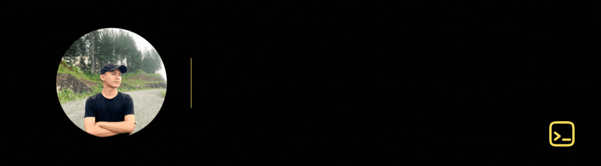

## Interests
- Developing real-world solutions.
- UI/UX.
- Automation systems.
- Cats.

## Technologies I Use

  
  
  
  
  
  
  
  
  
  
  
  
  
  
  
  
  
  
  
  
  
  
  
  
  

  
  
  
  
  
  
  
  
  
  
  
  
  

## 

 

  
<em>"Ang Kalibog mao ang sinugdan sa Kaalam"</em> - Kuya Earnie

